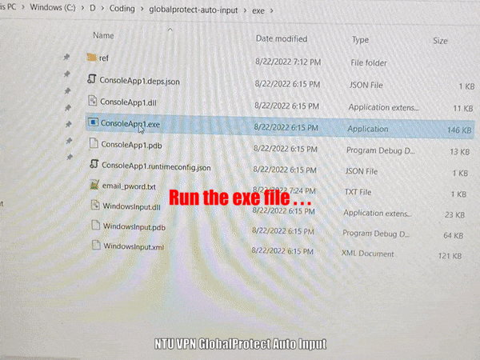

# GlobalProtect Trigger
NTU VPN tool GlobalProtect Auto Input (testing version). A demo is as below:



# Prerequisites
There are some restrictions you should know before using it.

## 1, Only on Windows OS
This tool is develped by C# on Windows OS. And so far it only works on Windows OS.
Its mechanism is just to simulate the keyboard click event. So it relays on the computer keyboard deeply. Different computer may have different keyboard layout, and therefore affect this tool. The developing environment is ThinkPad P14s, as below:


## 2, VPN tool GlobalProtect should be installed
The GlobalProtect path should be:
```
C:\Program Files\Palo Alto Networks\GlobalProtect\
```
This is also the default installation path. Currently, this path is hard coded in the `Auto Input` tool.

It has an icon in the system tray. And when triggered (clicked), it shows the small window in the bottom right of the desktop.


After clicking the "Connection" button, its popup dialog will show up like this:


# Usage
We can just clone or download the [/exe](./exe) folder, and run the `ConsoleApp1.exe` directly. The Email and password are in the file [./exe/email_pword.txt](./exe/email_pword.txt), under the same folder. We should specify our own information in this file, as below:

```
email:xxx001@student.main.ntu.edu.sg
pword:Abc@!@#$%^&*()[]{}\|L:"';l
```
The tool will read this file to get Email/password, and put them into the GlobalProtect popup dialog.
